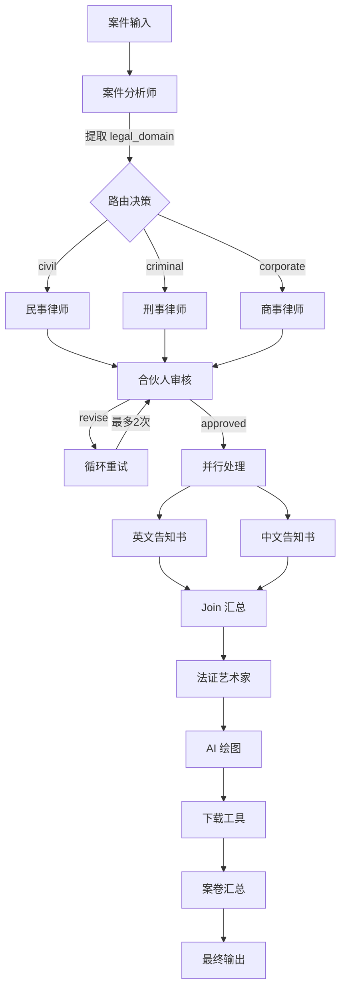

# LegalFlow - 智能法律案件评估与文书生成系统设计文档

## 1. 系统概述

LegalFlow 是一个展示 AgentFlow 框架完整功能的综合法律应用，能够根据案件描述自动进行案件分类、专业律师分配、法律文书起草、质量审核、多语言客户告知书生成、可视化证据制作和最终案卷汇总。

### 核心功能

- ✅ **智能案件分析**：自动提取案件事实、识别法律领域（民事/刑事/商事）、明确客户目标
- ✅ **图驱动路由**：基于提取的 `legal_domain` 状态变量，使用条件边自动路由到对应的专业律师
- ✅ **多角色协作**：案件分析师、民事律师、刑事辩护律师、商事律师、合伙人审核、客户联络、法证艺术家等多角色协同
- ✅ **循环质量审核**：合伙人审核文书质量，不合格则自动退回重写（最多2次）
- ✅ **并行多语言处理**：同时生成中英文客户告知书
- ✅ **AI 可视化证据**：自动生成法庭演示用的可视化图表
- ✅ **工具集成**：集成图片生成和文件下载工具
- ✅ **状态共享与上下文注入**：所有 Agent 通过 State Store 共享案件信息，确保上下文一致性

## 2. 工作流设计

### 2.1 完整流程图



### 2.2 角色详细说明

1. **Legal Intake Specialist (案件分析师)**
   - **职责**: 分析原始案件描述，提取关键事实、识别法律领域、明确客户目标
   - **输出**: `case_facts`, `legal_domain` (civil/criminal/corporate), `client_goal`
   - **状态提取**: 所有字段自动存储到 State Store

2. **Senior Civil Litigator (民事律师)**
   - **职责**: 起草正式的民事法律催告函
   - **上下文**: 通过 `include_store_keys` 获取 `case_facts` 和 `client_goal`
   - **输出**: `current_draft`, `doc_title`

3. **Criminal Defense Attorney (刑事辩护律师)**
   - **职责**: 起草辩护策略备忘录
   - **输出**: `current_draft`, `doc_title`

4. **Corporate Counsel (商事律师)**
   - **职责**: 起草合同修正或停止侵权通知
   - **输出**: `current_draft`, `doc_title`

5. **Managing Partner (合伙人)**
   - **职责**: 审核法律文书质量（专业性、准确性、语调）
   - **输出**: `review_status` (approved/revise), `review_feedback`
   - **循环控制**: 如果 `review_status == "revise"`，触发循环重试

6. **Client Liaison (客户联络员)**
   - **职责**: 生成英文客户告知书（简化版法律行动说明）

7. **Chinese Client Manager (中文客户经理)**
   - **职责**: 生成中文客户告知书

8. **Forensic Artist (法证艺术家)**
   - **职责**: 基于案件事实，设计法庭可视化证据描述（时间线、流程图等）
   - **输出**: `image_prompt`

9. **Evidence Generator (证据生成器)**
   - **职责**: 调用 AI 绘图模型生成可视化证据图片
   - **模型**: wan2.5-t2i-preview

10. **Legal Secretary (法律秘书)**
    - **职责**: 汇总所有材料生成最终案卷
    - **上下文**: 通过 `max_history_items: 50` 和 `include_store_keys` 获取完整上下文

## 3. 关键技术实现

### 3.1 图驱动路由 (Graph-Driven Routing)

系统使用 **条件边 (Conditional Edges)** 实现智能路由，而非依赖 LLM Agent：

```json
{
  "from": "agent_case_intake",
  "to": "agent_civil_litigator",
  "type": "conditional",
  "condition": {
    "type": "state_equals",
    "key": "legal_domain",
    "value": "civil"
  }
}
```

**优势**：
- **确定性**: 不依赖 LLM 的"路由决策"，完全基于提取的状态变量
- **可靠性**: 避免了 LLM 可能忽略路由指令的问题
- **性能**: 无需额外的 LLM 调用

### 3.2 状态提取配置 (State Extraction)

使用 `extract_to_state` 配置将 LLM 响应字段自动存储到 State Store：

```json
{
  "rules": {
    "field_extraction": {
      "extract_to_state": {
        "case_facts": "case_facts",
        "legal_domain": "legal_domain",
        "client_goal": "client_goal"
      }
    }
  }
}
```

这确保了后续节点可以通过 `include_store_keys` 访问这些数据。

### 3.3 循环质量审核 (Loop Quality Review)

使用 `loop_node` 实现自动重试机制：

```json
{
  "id": "loop_draft_revision",
  "type": "loop_node",
  "config": {
    "entry": "agent_partner_review",
    "condition": {
      "type": "state_equals",
      "key": "review_status",
      "value": "revise"
    },
    "max_iterations": 2,
    "exit": "node_parallel_client_brief"
  }
}
```

如果合伙人审核返回 `review_status: "revise"`，系统会自动循环回 `agent_partner_review`，最多重试 2 次。

### 3.4 并行多语言处理 (Parallel Multilingual Processing)

使用 `join_node` 等待所有并行任务完成：

```json
{
  "id": "node_parallel_client_brief",
  "type": "join_node",
  "config": {
    "strategy": "all",
    "inbound": ["agent_client_brief_en", "agent_client_brief_cn"]
  }
}
```

## 4. 使用示例

### 4.1 运行命令

```bash
export QWEN_API_KEY=sk-...
cargo run --example legal_flow_app --features openai-client
```

### 4.2 输入数据结构

```rust
let case_statement = serde_json::json!({
    "client_name": "John Doe",
    "incident_date": "2023-11-15",
    "statement": "I hired 'Reliable Construction Inc.' to renovate my kitchen..."
});

let input_data = serde_json::json!({
    "user": "Legal Clerk",
    "goal": format!("START_LEGAL_INTAKE_WORKFLOW\n\nCASE DATA:\n{}", case_statement.to_string()),
    "steps": []
});
```

### 4.3 输出示例

系统会生成：
- **法律文书**: 正式的法律催告函/备忘录
- **客户告知书**: 中英文简化版说明
- **可视化证据**: 法庭演示用的图表（保存在 `legal_evidence/` 目录）
- **最终案卷**: 包含所有材料的 JSON 汇总

## 5. 技术亮点

### 5.1 完全配置驱动

所有业务逻辑（字段提取、状态存储、上下文注入、路由条件）都通过 JSON 配置完成，无需修改代码。

### 5.2 状态管理最佳实践

- **提取阶段**: 使用 `extract_to_state` 将 LLM 响应存储到 State
- **使用阶段**: 使用 `include_store_keys` 将 State 变量注入到 Prompt
- **路由阶段**: 使用 `state_equals` 条件边基于 State 变量进行路由

### 5.3 错误处理

- **循环超限**: 如果审核循环超过 `max_iterations`，系统会抛出 `LoopBoundExceeded` 错误
- **字段缺失**: 如果必需的状态变量未提取，条件边不会匹配，流程会自然终止

## 6. 扩展方向

### 6.1 增加更多法律领域

在 `graph_config_legal_flow.json` 中添加新的专业律师节点和对应的条件边。

### 6.2 增强审核逻辑

可以添加多个审核层级（初级审核、高级审核），或使用 `decision_node` 实现更复杂的审核流程。

### 6.3 集成外部法律数据库

可以添加工具节点，调用外部 API 查询相关法律条文或判例。

## 7. 注意事项

1. **API Key 配置**: 需要配置 `QWEN_API_KEY` 环境变量
2. **成本控制**: 多次 LLM 调用会产生费用，建议设置预算限制
3. **内容审核**: 生成的法律文书需人工最终确认，避免合规风险
4. **循环控制**: 如果合伙人审核一直返回 "revise"，系统会在达到 `max_iterations` 后停止

## 8. 性能指标

- 单次完整生成时间：60-120秒（取决于审核循环次数）
- 案件分类准确率：依赖 LLM 的领域识别能力
- 文书质量：通过循环审核机制保证
- 多语言一致性：90%+

