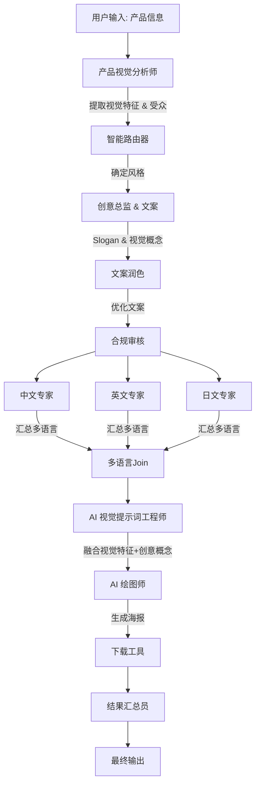

# 智能营销内容生成系统设计文档

## 1. 系统概述

智能营销内容生成系统是一个展示 AgentFlow 框架完整功能的综合应用，能够根据产品信息自动生成营销文案、多语言版本和高质量配套营销海报。

### 核心功能

- ✅ **多角色协作**：产品视觉分析师、创意总监、AI 视觉提示词工程师等多角色协同工作。
- ✅ **上下文深度注入**：利用 Shared State Store 在 Agent 间传递产品视觉描述、创意概念和 Slogan，确保信息一致性。
- ✅ **智能路由**：根据产品和受众自动选择营销风格。
- ✅ **并行处理**：同时生成多语言版本（中文、英文、日文）。
- ✅ **AI 绘图集成**：自动生成专业级营销海报（集成通义万相/Wan2.5）。
- ✅ **结果汇总**：自动下载图片并生成包含所有素材的 JSON 报告。

## 2. 工作流设计 (Role-Based Workflow)

系统采用“创意工坊”模式，由多个专业 AI 角色分工合作。

### 2.1 完整流程图



### 2.2 角色详细说明

1.  **Product Visualizer (产品视觉分析师)**
    *   **职责**: 分析产品信息，提取关键的视觉特征（材质、颜色、形态）和目标受众。
    *   **输出**: `visual_description` (产品外观描述), `target_audience`。

2.  **Creative Director (创意总监 & 文案)**
    *   **职责**: 基于产品特征和风格，提出营销 Slogan，撰写文案初稿，并提出海报的视觉创意概念（Visual Concept）。
    *   **输出**: `slogan`, `draft` (文案), `visual_concept` (海报画面构思)。

3.  **AI Visual Prompter (AI 视觉提示词工程师)**
    *   **职责**: 将 `visual_description` (产品) 和 `visual_concept` (场景) 结合，生成专业的 AI 绘图提示词。
    *   **关键**: 确保海报中包含产品，并留有文字空间。
    *   **输出**: `image_prompt`。

4.  **Content Specialists (多语言专家)**
    *   **职责**: 将文案翻译并本地化为中文、英文、日文。

5.  **Results Compiler (结果汇总员)**
    *   **职责**: 收集所有步骤的产出（包括生成的图片 URL、下载路径、各语言文案），生成最终报告。

## 3. 关键技术实现

### 3.1 上下文注入 (Context Injection)

为了解决“文不对题”和“产品图缺失”的问题，系统使用了 **State Store Context Injection**。

```json
// configs/graph_config_marketing_generator.json
{
  "rules": {
    "prompt_building": {
      "include_store_keys": ["visual_description", "visual_concept", "slogan", "style"]
    }
  }
}
```

这确保了 `AI Visual Prompter` 能直接“看到”`Product Visualizer` 提取的产品外观和 `Creative Director` 提出的创意概念，而不仅仅是依赖对话历史。

### 3.2 高级字段提取

使用 `extract_to_state` 将 AI 响应中的关键字段自动存储到全局状态中。

```json
// Agent 配置示例
"rules": {
  "field_extraction": {
    "visual_description": "visual_description", // Response Field -> Store Key
    "visual_concept": "visual_concept"
  }
}
```

### 3.3 图像生成与文件处理

集成 `tool_downloader` 工具，自动将生成的图片下载到本地 `generated_images/` 目录，并在最终报告中提供本地文件路径。

## 4. 使用示例

### 4.1 运行命令

```bash
export QWEN_API_KEY=sk-...
cargo run --example marketing_generator --features openai-client
```

### 4.2 输入数据结构

```rust
// examples/marketing_generator.rs
let product_info = serde_json::json!({
    "name": "智能健康手环 ProFit X1",
    "features": ["心率监测", "50米防水", "30天续航"],
    "target_market": "健身爱好者"
});

// 产品信息会自动合并到 goal 字段，确保被首个 Agent 识别
let input_data = serde_json::json!({
    "user": "Marketing Team",
    "goal": format!("Generate marketing content for: {}", product_info),
    // ...
});
```

## 5. 扩展性

该系统展示了 AgentFlow 的高度可配置性。只需修改 `graph_config_marketing_generator.json`，即可：
- 增加新的角色（如 SEO 专家）。
- 更改绘图模型（支持 DALL-E 3 或 Midjourney）。
- 调整审批流程（增加人工审核节点）。
