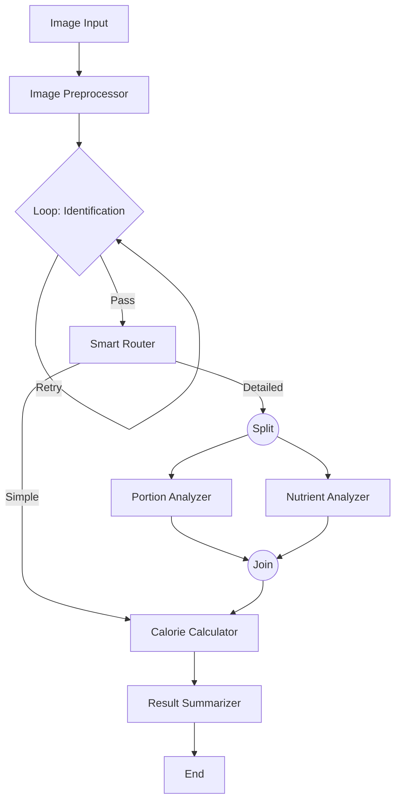

# 食物识别分析应用设计文档

## 应用概述

一款基于 AgentFlow 的高级智能食物识别与分析应用，集成了框架的核心高级特性，旨在提供精准、健壮且灵活的分析流程。

应用利用 Qwen-VL 多模态模型，通过**LangGraph 风格的复杂工作流**编排，实现从图像输入到深度营养报告生成的全自动化。

## 核心业务功能

根据 `configs/graph_config_food_analysis.json` 配置，应用包含以下功能：

1.  **图像预处理 (Image Preprocessing)**
    *   **Agent**: `agent_image_preprocessor`
    *   分析图片质量，作为后续流程的输入。

2.  **稳健的食物识别 (Robust Food Identification)**
    *   **Agent**: `agent_food_identifier` (运行在 `node_loop_identifier` 中)
    *   **特性**: 具备自我校验机制，如果识别置信度低，会自动重试（Loop 节点），确保识别结果可靠。

3.  **智能路由决策 (Smart Routing)**
    *   **Agent**: `agent_smart_router`
    *   **特性**: 根据识别结果的复杂度和用户需求，动态选择分析路径：
        *   **Simple 路径**: 直接计算卡路里，快速响应。
        *   **Detailed 路径**: 进行深度的分量和微量营养素分析。

4.  **并行深度分析 (Parallel Deep Analysis)**
    *   **组件**: `agent_portion_analyzer` 和 `agent_nutrient_analyzer`
    *   **特性**: 在 Detailed 路径下，**并行执行**分量估算和微量营养素分析，通过 `node_join_analysis` 聚合结果，提升效率。

5.  **卡路里计算与汇总**
    *   **Agent**: `agent_calorie_calculator` & `agent_result_summarizer`
    *   基于前序步骤的所有数据，计算最终热量并生成结构化报告。

## 关键技术特性

本应用展示了 AgentFlow 框架的完整能力：

1.  **循环迭代 (Loops)**: 使用 `loop_node` 封装识别 Agent，通过 `confidence_check` 状态控制重试逻辑。
2.  **自动路由 (Auto Routing)**: 使用 `agent_smart_router` 提取 `analysis_route` 状态，配合条件边 (`conditional`) 实现动态分支。
3.  **并行处理 (Parallel Processing)**: 通过条件边同时触发两个 Agent，并使用 `join_node` (`strategy: "all"`) 等待它们全部完成。
4.  **多模态支持**: 集成 `qwen-vl-max` 处理图像输入。
5.  **结构化输出**: 所有 Agent 均输出 JSON 并自动提取关键字段到 `FlowContext`。

## 工作流设计

### 节点序列与逻辑

1.  **Start**: `agent_image_preprocessor`
2.  **Loop**: `node_loop_identifier` (Entry: `agent_food_identifier`)
    *   *Condition*: `confidence_check == "retry"` (Max 3 iterations)
3.  **Router**: `agent_smart_router`
4.  **Branching**:
    *   If `analysis_route == "simple"` -> Go to `agent_calorie_calculator`
    *   If `analysis_route == "detailed"` -> Go to `agent_portion_analyzer` AND `agent_nutrient_analyzer`
5.  **Parallel Execution** (Detailed Mode):
    *   `agent_portion_analyzer`
    *   `agent_nutrient_analyzer`
6.  **Join**: `node_join_analysis` (Wait for both analyzers)
7.  **Calculation**: `agent_calorie_calculator`
8.  **Summary**: `agent_result_summarizer`
9.  **End**: `node_terminal`

### 数据流向图

## Agent 详细配置

所有 Agent 均使用 Qwen 系列模型。

*   **Image Preprocessor**: 检查图片质量。
*   **Food Identifier**: 识别食物，返回 `confidence_check` 状态。
*   **Smart Router**: 决定 `analysis_route` ("simple" / "detailed")。
*   **Portion Analyzer**: 估算重量和单位。
*   **Nutrient Analyzer**: 分析维生素和矿物质。
*   **Calorie Calculator**: 计算总热量。
*   **Result Summarizer**: 生成最终报告。

## 扩展性

该设计已具备高度扩展性，未来可轻松添加：
*   更多分析维度的并行分支（如：过敏原检测）。
*   更复杂的路由逻辑（如：基于用户画像的个性化路由）。
*   人工介入审核节点（Human-in-the-loop）。
